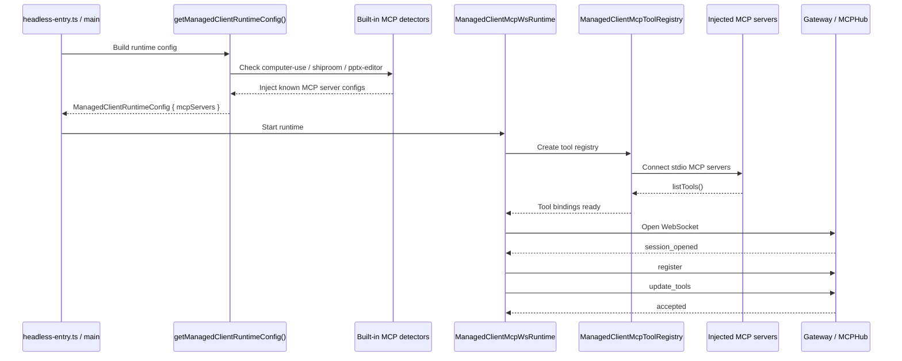

# Worker MCP Discovery Sequence

## Purpose

This document explains what actually happens when a LandGod Worker starts and publishes MCP-backed capability from the bundled [mcp-servers](c:/edge_workspace_1/cli-server/mcp-servers) directory.

It describes the **current implementation**, which is:

- not a generic directory scan
- but a built-in injection flow for known MCP servers

---

## Short Version

Today the Worker does **not** enumerate all subdirectories under `mcp-servers/` and auto-load them.

Instead, startup does this:

1. build managed client runtime config
2. detect a fixed set of built-in MCP servers
3. inject MCP server configs for those known servers
4. connect them as stdio MCP clients
5. call `listTools()`
6. publish the resulting tool list to Gateway via `update_tools`

The current built-in MCP set is:

- `computer-use`
- `shiproom`
- `pptx-editor`

---

## Sequence Overview

---

## Detailed Flow

### 1. Startup Entrypoint Sets Package Context

Worker startup begins in [src/main/headless-entry.ts](c:/edge_workspace_1/cli-server/src/main/headless-entry.ts).

Important behaviors:

- computes package root
- sets `LANDGOD_DATA_DIR`
- changes `process.cwd()` to package root
- calls `getManagedClientRuntimeConfig()`

Why this matters:

- config files like `managed-client.config.json` and `managed-client.mcp-servers.json` are resolved from `process.cwd()`
- built-in MCP path helpers also rely on this root in development mode

---

### 2. Runtime Config Builds Effective MCP Server Set

The main configuration logic lives in [src/main/managed-client/config.ts](c:/edge_workspace_1/cli-server/src/main/managed-client/config.ts).

At this stage the Worker:

- reads user config
- reads user-defined `managed-client.mcp-servers.json`
- computes `effectiveMcpConfig`
- parses it into `mcpServers`

But before producing the final config, it performs **hardcoded built-in detection** for three known MCP servers.

---

### 3. Built-In MCP Detection Is Explicit, Not Generic

The current implementation contains explicit injection logic for:

#### `computer-use`

The Worker checks whether Python can import `landgod_computer_use` using the bundled path under `mcp-servers/computer-use`.

If available and not overridden by user config, it injects a stdio MCP config.

#### `shiproom`

The Worker checks:

- whether `server.py` exists in `mcp-servers/shiproom-mcp`
- whether Python is available

If available and not overridden by user config, it injects a stdio MCP config pointing directly to `server.py`.

#### `pptx-editor`

The Worker checks:

- whether the Python package exists under `mcp-servers/pptx-editor`
- whether Python can import `landgod_pptx_editor`
- on Windows, whether platform requirements are met

If available and not overridden by user config, it injects a stdio MCP config using `python -m landgod_pptx_editor`.

---

## Current Detection Model

### What It Is

The current model is:

**known built-in MCP injection**

### What It Is Not

It is not:

- directory enumeration of all `mcp-servers/*`
- manifest-driven plugin discovery
- generic auto-registration of new MCP server folders

That means adding `mcp-servers/foo` today does nothing by itself.

For a new bundled MCP to auto-appear, code must be added to:

- detect it
- compute its command/env/path
- inject its config

---

## 4. Tool Registry Connects Injected MCP Servers

After runtime config is built, [src/main/managed-client/mcp-ws-runtime.ts](c:/edge_workspace_1/cli-server/src/main/managed-client/mcp-ws-runtime.ts) creates a [ManagedClientMcpToolRegistry](c:/edge_workspace_1/cli-server/src/main/managed-client/mcp-tool-registry.ts).

The registry:

1. receives `externalServerConfigs`
2. creates stdio MCP clients for them
3. connects each client
4. calls `listTools()`
5. builds tool bindings for publication

Built-in injected MCP servers are published as `source: 'local'`, even though they are connected as external stdio servers under the hood.

---

## 5. Worker Publishes Tools To Gateway

Once the registry has built tool definitions, the runtime performs the WebSocket handshake:

1. wait for `session_opened`
2. send `register`
3. send `update_tools`

The `update_tools` payload contains the merged tool surface from:

- the local built-in MCP server created by `createMcpServer(...)`
- injected built-in MCP servers such as `computer-use`, `shiproom`, and `pptx-editor`
- optional user-defined external MCP servers

Gateway only sees the final published tool list. It does not scan `mcp-servers/` itself.

---

## Practical Implication

If you add a new folder under [mcp-servers](c:/edge_workspace_1/cli-server/mcp-servers), the Worker will not auto-discover it today unless you also add code for:

- path resolution
- availability detection
- injected config construction
- optional built-in publication behavior

That limitation is what motivates the proposed directory-level discovery design in [docs/11-mcp-directory-autodiscovery-design.md](docs/11-mcp-directory-autodiscovery-design.md).
