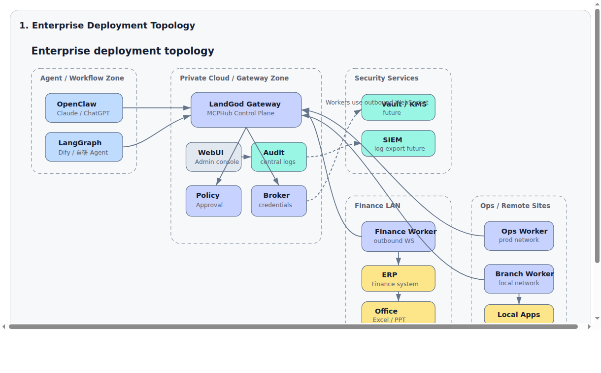
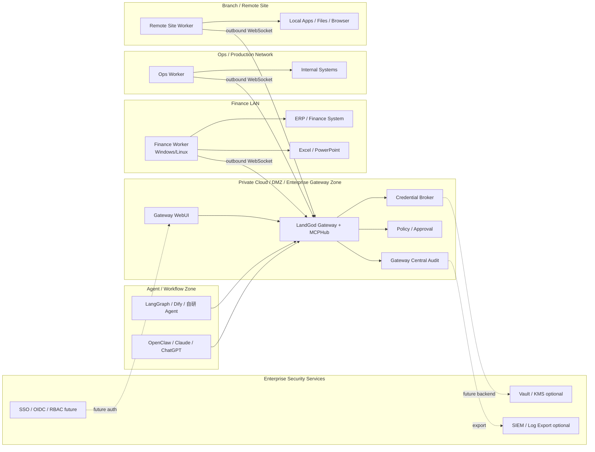
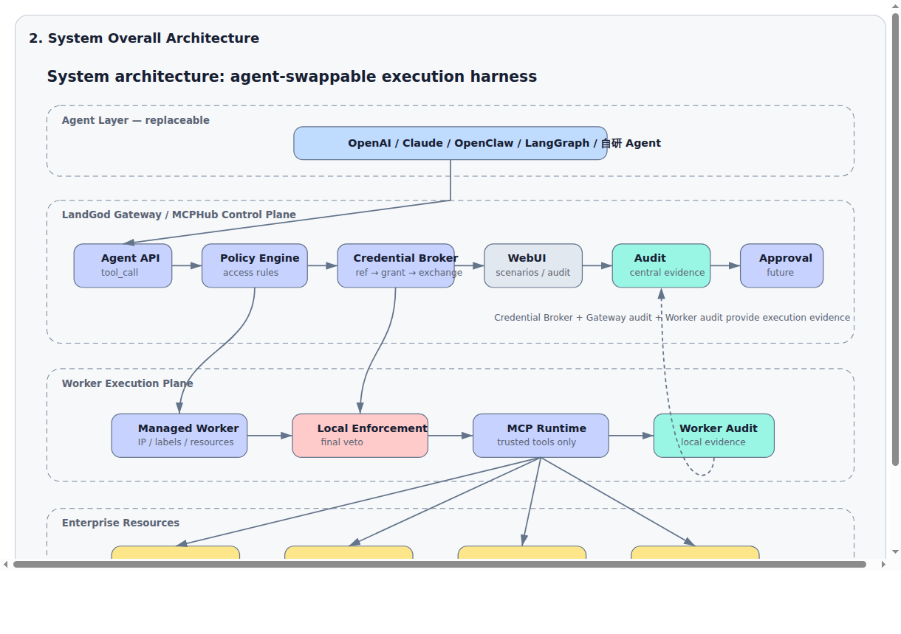
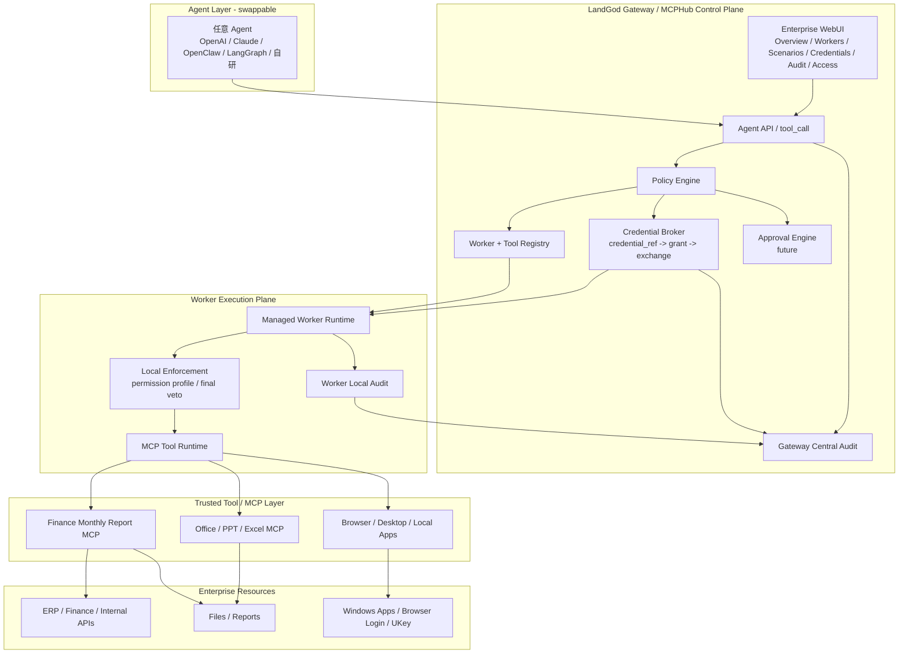

<!-- Source: /home/azureuser/wiki/concepts/landgod-mcphub-enterprise-pitch-script.md -->

# LandGod / MCPHub Enterprise Pitch Script

## One-line Positioning

> **LandGod / MCPHub 是 AI Agent 的 Enterprise Execution Harness：让任意 Agent 安全调用企业真实环境里的机器、工具、凭据和流程，并留下可审计、可追责的执行证据。**

更口语化：

> **大模型负责思考，LandGod 负责让它在企业里安全动手干活。**

相关页面：LandGod / MCPHub Research、LandGod Enterprise Trust Chain、Enterprise Required Node Topology、Gateway API、MCP-WS Protocol、MCP Protocol。

---

## 0. Executive Summary

LandGod / MCPHub 的起源很朴素：**很多有价值的企业工具只有 CLI、本地程序、桌面流程或机器绑定环境，没有干净 API；云上的 Agent 想用，但调不到。**

最初问题不是“我要远程控制电脑”，而是：

```text
如何让 Agent 安全调用那些没有 API、但真实有用的本地 CLI / 工具能力？
```

从这个 CLI/no-API gap 出发，命题自然扩展到企业执行层：能力不只散落在 CLI，也散落在内网、Windows 客户端、UKey、Office、浏览器登录态、文件系统、老 ERP 和本地脚本里。LandGod / MCPHub 要做的是把这些机器绑定能力安全注册成 Agent 可调用、可调度、可审计的企业工具池。

企业现在不缺 AI 大脑。OpenAI、Claude、通义、DeepSeek、企业自研 Agent 都已经能理解问题、规划步骤、写代码、分析文档。

真正卡住企业落地的是最后一公里：

```text
AI 知道该做什么，
但它进不了企业真实系统，
拿不到受控权限，
不能安全使用凭据，
不能在正确机器上执行，
更不能让安全团队相信它做过什么。
```

LandGod / MCPHub 解决的是这个问题。

它不是又一个 Agent Framework，也不是单个 MCP Server。它是：

```text
Gateway 控制面
+ Worker 执行面
+ MCP/Tool Registry
+ Credential Broker
+ Worker Security Profile
+ Approval / Audit
+ Gateway WebUI
```

组成的企业执行层。

一句话：

> **MCP Server 连接 API 化世界；LandGod / MCPHub 连接还没 API 化、但真实存在于企业机器和网络环境里的业务能力。**

---

## 1. 30-second Pitch

> LandGod / MCPHub 起源于一个很现实的问题：很多企业能力只有 CLI、本地工具或机器绑定流程，没有 API，云上 Agent 调不到。今天企业上 AI Agent，最大问题不是模型不会思考，而是 Agent 没法安全进入真实业务环境执行。很多系统没有 API，在内网、Windows 客户端、财务电脑、Office、UKey、浏览器登录态里。LandGod / MCPHub 把这些分散在企业机器上的本地工具和权限，通过 Gateway + Worker 注册成统一工具池，让任意 Agent 按权限、按策略、按审计调用。Agent 不直接接触密码，Gateway 做中央策略和凭据中介，Worker 在本地执行并保留审计。最终企业得到的是一个可控、可审批、可审计的 AI 执行层。

---

## 2. 3-minute Pitch Script

### Opening

LandGod / MCPHub 的起点不是一个宏大概念，而是一个很具体的痛点：

> 有些工具只有 CLI，没有 API；有些流程只能在某台机器、本地网络、桌面环境或登录态里跑。云上的 Agent 明明知道该调用什么，却调不到。

所以最初的问题不是“如何远程控制电脑”，而是：

> **如何让 Agent 安全调用没有 API 的本地工具能力？**

现在很多企业都在试 AI Agent，但很快会发现同一个现实问题：

> Agent 很聪明，但落地业务时经常停在“我建议你怎么做”。

为什么？因为企业真正的执行环境不是一个干净 API 世界，而是：

- ERP 在内网；
- 财务系统需要指定电脑和 UKey；
- 报表在 Windows 文件夹里；
- PowerPoint、Excel、浏览器登录态都在员工电脑上；
- 老系统没有 API；
- 安全团队不允许把密码、证书、客户数据直接交给 Agent。

所以企业 AI 落地真正缺的是：

> **一个让 Agent 安全连接真实企业环境的执行 Harness。**

### Solution

LandGod / MCPHub 就是这个 Enterprise Execution Harness。

它的架构很简单：

```text
任意 Agent
  ↓
LandGod / MCPHub Gateway
  ↓
Worker × N
  ↓
企业真实机器、工具、系统、文件、Office、Browser、MCP
```

Gateway 是控制面，负责：

- Worker 管理；
- 工具注册；
- 路由调度；
- 权限策略；
- Credential Broker；
- 审批；
- 中央审计；
- WebUI 管理台。

Worker 是执行面，部署在企业真实机器上，负责：

- 本地工具执行；
- 本地 MCP 连接；
- 本地安全兜底；
- 本地审计；
- 访问内网、Office、浏览器、桌面软件、旧系统。

### Differentiation

传统 MCP Server 解决的是：

```text
已有 API → 包成 MCP tool
```

LandGod / MCPHub 解决的是：

```text
机器 + 网络位置 + 登录态 + 本地工具 + 权限 + 审计 → 注册成企业工具执行网络
```

这就是差异。

### Trust

企业最担心 AI 乱操作、泄露凭据、审计不清。LandGod 的设计不是给 AI 一台裸电脑，而是给 AI 一个受控执行边界。

例如凭据使用：

```text
Agent 只传 credential_ref
Gateway policy check
Gateway 签发 task-scoped single-use grant
Worker 验证 grant
Worker exchange 短期 credential
trusted tool 执行
Gateway + Worker 双审计
```

Agent 永远看不到 secret。

### Value

客户得到的不是一个玩具自动化，而是：

```text
把 AI 从“会回答”推进到“能在企业里安全执行”。
```

---

## 3. Customer Pain Points

### Pain 1: 企业系统没有 API，API 改造太慢

现实：

```text
老 ERP
供应商门户
税务/银行网站
Windows 客户端
Office 文档流程
内网后台
```

很多系统短期不可能 API 化。

LandGod 价值：

> **不等系统改造，先通过 Worker 把机器上的能力注册给 Agent。**

### Pain 2: Agent 被困在单机环境

Agent 本机没有：

- 企业内网；
- Windows；
- Office；
- GPU；
- 中国区网络；
- 客户现场网络；
- 浏览器登录态；
- UKey/证书环境。

LandGod 价值：

> **Agent 不搬数据、不搬权限，而是调度正确环境里的 Worker 执行。**

### Pain 3: 凭据不能交给 Agent

企业不能接受：

```text
把财务密码写进 prompt
把 API token 发给 Agent
让 Worker 随便拉密钥
让任意 MCP 拿 credential
```

LandGod 价值：

> **Credential Broker 让 Agent 只使用 credential_ref，密钥由 Gateway 管理，Worker 通过 task-scoped grant 临时使用。**

### Pain 4: AI 执行缺少审批和审计

安全团队会问：

- 谁发起？
- 谁批准？
- 哪台机器执行？
- 调用了什么工具？
- 用了哪个凭据？
- 参数有没有被改？
- 结果是什么？
- 日志是否可追溯？

LandGod 价值：

> **Gateway 中央审计 + Worker 本地审计双备份，形成可追责执行证据链。**

### Pain 5: 每台机器单独配置不可运维

企业有几十台 Worker 后，如果每台单独改配置，会出现：

```text
配置漂移
权限不一致
审计困难
故障排查困难
安全团队无法统一管理
```

LandGod 价值：

> **Gateway WebUI 作为中央控制台，后续通过 Worker Security Profile 统一下发策略。**

---

## 4. Core Story

### The Story

AI Agent 已经有大脑，但企业需要它真正完成工作。

企业真实工作不是发生在一个 API 端点里，而是发生在很多分散环境里：

```text
财务电脑
HR 系统
ERP 客户端
浏览器登录态
Office 文件
内网数据库
供应商门户
UKey/证书
员工桌面软件
```

LandGod / MCPHub 的核心故事是：

> **把这些分散在企业机器和网络环境里的能力，注册成一个受控、可调度、可审计的企业工具网络。**

然后任意 Agent 可以通过 Gateway 调用：

```text
我要中国区 Worker 上的 browser tool
我要财务组 Worker 的 invoice.read
我要 Windows Office Worker 生成 PPT
我要内网 Worker 读取 ERP 报表
```

Gateway 决定是否允许，Worker 决定本机是否执行，Tool 决定是否安全接收凭据。

```text
Gateway says MAY
Worker says CAN
Tool says SAFE
Approval says YES
Audit says PROVE IT
```

---

## 5. Technical Architecture

### High-level Architecture

```text
任意 Agent / OpenClaw / Claude / LangGraph / AutoGen / 企业自研 Agent
                              │
                              │ HTTP / SDK / MCP Adapter
                              ▼
                 LandGod / MCPHub Gateway
   ┌──────────────────────────┼──────────────────────────┐
   │                          │                          │
Auth / RBAC              Routing / Queue             Policy / Audit
Credential Broker        Worker Registry             Gateway WebUI
   │                          │                          │
   └──────────────────────────▼──────────────────────────┘
                         Worker × N
   ┌──────────────────────────┼──────────────────────────┐
   ▼                          ▼                          ▼
Windows Worker           Linux Worker                Internal Worker
Office / Desktop         Shell / File / GPU          ERP / DB / Browser
Computer Use             MCP stdio/http              UKey / Login State
```


### Enterprise Deployment Topology Diagram



Printable HTML version: [landgod-enterprise-architecture-diagrams.html](./landgod-enterprise-architecture-diagrams.html)

ASCII version:

```text
                         Agent / Workflow Zone
        +------------------------------------------------------+
        |  OpenClaw / Claude / ChatGPT / LangGraph / 自研 Agent |
        +--------------------------+---------------------------+
                                   |
                                   |  HTTP / MCP / SDK
                                   v
        +------------------------------------------------------+
        |        Private Cloud / DMZ / Gateway Zone             |
        |                                                      |
        |  +-------------------+      +----------------------+  |
        |  | Gateway WebUI     | ---> | LandGod Gateway      |  |
        |  | Governance Console|      | MCPHub Control Plane |  |
        |  +-------------------+      +----+------+-----+----+  |
        |                                  |      |     |       |
        |                  +---------------+      |     +----------------+
        |                  |                      |                      |
        |          +-------v--------+     +-------v--------+     +-------v-------+
        |          | Policy /       |     | Credential     |     | Gateway       |
        |          | Approval       |     | Broker         |     | Central Audit |
        |          +-------+--------+     +-------+--------+     +-------+-------+
        +------------------|----------------------|----------------------|--------+
                           |                      |                      |
                           | future               | future               | export
                           v                      v                      v
                  +----------------+      +----------------+      +---------------+
                  | SSO/OIDC/RBAC  |      | Vault / KMS    |      | SIEM / Logs   |
                  +----------------+      +----------------+      +---------------+

        Worker nodes connect OUTBOUND to Gateway. Gateway does not need
        inbound access to enterprise machines.

        +----------------------+      outbound WebSocket       +------------------+
        | Finance LAN          | ----------------------------> | LandGod Gateway  |
        |  Finance Worker      |                               |                  |
        |   -> ERP / Finance   |                               |                  |
        |   -> Excel / PPT     |                               |                  |
        +----------------------+                               |                  |
                                                               |                  |
        +----------------------+      outbound WebSocket       |                  |
        | Ops / Production Net | ----------------------------> |                  |
        |  Ops Worker          |                               |                  |
        |   -> Internal Systems|                               |                  |
        +----------------------+                               |                  |
                                                               |                  |
        +----------------------+      outbound WebSocket       |                  |
        | Branch / Remote Site | ----------------------------> |                  |
        |  Site Worker         |                               |                  |
        |   -> Local Apps      |                               |                  |
        |   -> Files / Browser |                               |                  |
        +----------------------+                               +------------------+
```




### System Architecture Diagram



Printable HTML version: [landgod-enterprise-architecture-diagrams.html](./landgod-enterprise-architecture-diagrams.html)

ASCII version:

```text
+---------------------------+
| Agent Layer - swappable   |
| OpenAI / Claude / OpenClaw|
| LangGraph / Dify / 自研   |
+-------------+-------------+
              |
              | tool_call + agent_id + credential_ref + arguments
              v
+-------------+-----------------------------------------------------+
| LandGod Gateway / MCPHub Control Plane                            |
|                                                                   |
|  +-------------------+      +-------------------+                  |
|  | Agent API         | ---> | Policy Engine     | ----------------+|
|  | /tool_call        |      | Effective Access  |                 ||
|  +---------+---------+      +---------+---------+                 ||
|            |                          |                           ||
|            |                          v                           ||
|            |                +---------+---------+                 ||
|            |                | Worker + Tool     |                 ||
|            |                | Registry          |                 ||
|            |                +---------+---------+                 ||
|            |                          |                           ||
|            |                          v                           ||
|            |                +---------+---------+                 ||
|            |                | Credential Broker |                 ||
|            |                | ref -> grant      |                 ||
|            |                | grant -> exchange |                 ||
|            |                +---------+---------+                 ||
|            |                          |                           ||
|            v                          v                           ||
|  +---------+---------+      +---------+---------+                 ||
|  | Gateway WebUI     |      | Approval Engine   | future          ||
|  | Governance Console|      +-------------------+                 ||
|  +---------+---------+                                            ||
|            |                                                      ||
|            v                                                      ||
|  +---------+---------+                                            ||
|  | Gateway Central  | <-------------------------------------------+|
|  | Audit            |                                             |
|  +------------------+                                             |
+-------------+-----------------------------------------------------+
              |
              | signed tool_call / credential_grant
              | outbound Worker WebSocket channel
              v
+-------------+-----------------------------------------------------+
| Worker Execution Plane                                            |
|                                                                   |
|  +-------------------+      +-------------------+                  |
|  | Managed Worker    | ---> | Local Enforcement |                  |
|  | Runtime           |      | final veto        |                  |
|  +---------+---------+      +---------+---------+                  |
|            |                          |                            |
|            |                          v                            |
|            |                +---------+---------+                  |
|            |                | MCP Tool Runtime  |                  |
|            |                +---------+---------+                  |
|            |                          |                            |
|            v                          v                            |
|  +---------+---------+      +---------+-------------------------+  |
|  | Worker Local     |      | Trusted Tools / MCP               |  |
|  | Audit            |      | Finance Report / Office / Browser |  |
|  +---------+---------+      +---------+-------------------------+  |
+------------|--------------------------|----------------------------+
             |                          |
             | audit backup             | local execution
             v                          v
+------------+-----------+   +----------+----------------------------+
| Gateway Central Audit  |   | Enterprise Resources                  |
| Credential Audit       |   | ERP / Finance / Files / Office / UKey |
+------------------------+   +---------------------------------------+
```



### Component Responsibilities

| Component | Responsibility |
|---|---|
| Agent | 思考、规划、选择工具、解释结果 |
| Gateway | 控制面：认证、路由、策略、凭据、审计、WebUI |
| Worker | 执行面：本地工具、MCP、桌面/内网/文件系统能力 |
| MCP / Tool Registry | 把本地工具注册为可远程调度能力 |
| Credential Broker | 管理 secret，签发 single-use grant，执行 exchange |
| Worker Security Profile | 中央化配置 Worker 安全能力与发布策略 |
| Approval Engine | 高风险动作人工审批 |
| Audit System | Gateway 中央审计 + Worker 本地审计双备份 |

### Data / Control Flow

```text
1. Worker 主动连接 Gateway WebSocket
2. Worker 注册 clientId、labels、resources、tools
3. Agent 调 Gateway /tool_call
4. Gateway 根据 clientName / labels / policy 路由到 Worker
5. Gateway 签名 tool_call
6. Worker 验证请求并做本地安全检查
7. Worker 调用本地 tool / MCP
8. Worker 返回结果
9. Gateway 写中央审计，Worker 写本地审计
```

### Credential Flow

```text
Agent
  │ credential_ref
  ▼
Gateway Credential Broker
  │ policy check
  │ issue grant: worker-bound + tool-bound + args-bound + single-use
  ▼
Worker
  │ validate grant signature / request_id / worker_id / connection_id / arguments_hash
  │ exchange grant
  ▼
Gateway /credential/exchange
  │ returns short-lived credential
  ▼
Trusted Tool
  │ receives _landgod_credential only if credential-capable
  ▼
Audit
```

---

## 6. Security Architecture

### Core Security Claim

> **LandGod 不是给 AI 裸权限，而是把 AI 执行放进一条企业信任链里。**

### Enterprise Trust Chain

详见 LandGod Enterprise Trust Chain。

```text
Identity Trust
Device / Worker Trust
Tool / MCP Trust
Credential Trust
Policy Trust
Approval Trust
Execution Trust
Audit Trust
Release / Supply Chain Trust
```

### Current MVP Security Capabilities

当前系统已具备：

```text
Worker token / clientId / connectionId
Optional Gateway Admin Auth
Gateway Credential Broker
credential_ref
credential_scope
single-use grant
arguments_hash
worker-bound / connection-bound exchange
trustLevel
credentials.enabled
allowedScopes
requested_scope
allowedTools wildcard blocked by default
Worker server-side label override via token binding
requireExactWorkerId for high-value credentials
Finance / credential Worker isolation
credential + shell/file/session/admin tools forbidden
exact secret redaction on Worker response
Gateway WebUI MVP with admin-token prompt
Gateway central audit
Worker local audit
Credential audit
```

### Double Audit Backup

审计不是只存在 Worker 本地，也不是只存在 Gateway。

```text
Gateway audit:
- worker_connection_opened
- worker_registered
- worker_tools_updated
- tool_call_dispatched
- tool_call_result_received
- tool_call_error_received
- tool_call_timeout

Worker audit:
- tool_call received
- tool_call completed
- tool_call failed
- local tool / MCP execution evidence

Credential audit:
- credential_created
- credential_grant_issued
- credential_exchange_allowed
- credential_exchange_denied
```

企业可以用两份日志互相印证：

```text
Gateway 证明中央确实派发过
Worker 证明本机确实执行过
Credential audit 证明凭据使用符合策略
```

### Security Boundary

```text
Agent 不直接拿 secret
Gateway 不盲发 secret
Worker 不能随便拉 secret
Tool 默认不能接 credential
只有 trusted + credentials.enabled 的 tool 才能接 credential
shell/file/session/admin 类工具默认禁止 credential
```

### Production Hardening Roadmap

Implemented P0 baseline：

```text
Optional Gateway Admin Auth
Credential allowedTools wildcard blocked by default
credential_scope end-to-end
Worker token binding / server-side labels
requireExactWorkerId
Finance / credential Worker isolation
exact secret redaction
P0 Credential Broker tests
```

Next P1：

```text
Full Approval Engine
Server-side Effective Access API
Policy Sync / Ack
Audit hash chain
MCP connector signing
SIEM export
```

P2：

```text
SSO / fine-grained RBAC
Vault / KMS integration
Release signing / SBOM
Worker attestation
Network egress policy enforcement
```

---

## 7. Business Value / ROI

### Value 1: Reduce API Refactoring Cost

传统方式：

```text
先改造系统 API
再做权限
再做 MCP Server
再让 Agent 调用
```

周期可能是数周到数月。

LandGod 方式：

```text
在已有机器部署 Worker
注册本地工具 / MCP
通过 Gateway 接入 Agent
```

价值：

> **先让 AI 进入流程，再逐步 API 化核心系统。**

### Value 2: Automate Repetitive Enterprise Workflows

适合高频流程：

```text
导报表
对账
发票核验
PPT/Excel 生成
客户门户数据下载
内网巡检
多系统数据搬运
```

典型 ROI 话术：

```text
原来每月人工 2 小时导表 + 校验
现在 Agent 调度 Worker 5-10 分钟完成初稿
人只负责审批和异常处理
```

### Value 3: Keep Data and Credentials in Place

企业不想把数据和权限搬到 Agent 机器。

LandGod 让：

```text
数据留在内网
凭据留在 Gateway / Vault
工具留在 Worker
Agent 只拿结果
```

### Value 4: Make AI Execution Governable

从安全团队视角：

```text
有权限边界
有审批
有审计
有 Worker 身份
有工具信任等级
有 credential_ref / grant
```

这让 AI 自动化从“黑盒操作”变成“可治理执行”。

### Value 5: Agent-agnostic Infrastructure

LandGod 不绑定某个模型或 Agent 框架。

可接：

```text
OpenClaw
Claude
LangGraph
AutoGen
CrewAI
企业自研 Agent
普通 HTTP client
MCP Adapter
```

价值：

> **企业换模型、换 Agent，上层变，执行网络不变。**

---

## 8. Typical Use Cases

### Use Case A: Finance Report Automation

痛点：

```text
财务人员每月登录银行/税务/ERP/供应商门户，下载报表，对账，做 Excel/PPT。
```

LandGod：

```text
财务 Worker 保留登录态 / UKey / 文件路径
Agent 通过 Gateway 调用 read-only connector
Credential Broker 管理 token/password
导出动作进入 audit
高风险导出可审批
```

收益：

```text
人工下载和整理时间减少
凭据不交给 Agent
审计可追溯
```

### Use Case B: Legacy ERP without API

痛点：

```text
ERP 没 API，只有 Windows 客户端或内网页面。
```

LandGod：

```text
在 ERP 可访问机器上部署 Worker
把操作封装成 MCP/tool
Gateway 统一调度
```

收益：

```text
不等 ERP 改造，先让 AI 参与流程
```

### Use Case C: Office / PPT Automation

痛点：

```text
经营报告需要跨系统取数、分析、生成 PPT/Excel。
```

LandGod：

```text
Agent 调度数据 Worker、分析 Worker、Office Worker
Windows Worker 处理 PowerPoint/Excel
```

收益：

```text
从“人肉复制粘贴”变成“AI 编排 + 人审核”
```

### Use Case D: Internal Ops / IT Automation

痛点：

```text
多台机器巡检、日志查看、服务状态、网络检查、文件读取、命令执行。
```

LandGod：

```text
Worker 主动出站连接 Gateway
Agent 按 labels 批量调度
Gateway 记录中央 audit
Worker 记录本地 audit
```

收益：

```text
减少 SSH 管理复杂度
统一审计
支持批量和异步任务
```

---

## 9. Demo Script

### Demo Goal

展示：

```text
Agent 通过 Gateway 调用 Worker
Worker 发布工具
Credential Broker 安全使用凭据
Gateway + Worker 双审计
WebUI 可视化管理
```

### Demo Flow

1. 打开 Gateway WebUI。

```text
Overview: Gateway status / Workers / Tools / Credentials / Audit
```

2. 展示 Worker 在线。

```text
Worker: finance-local-worker
labels: group=finance, env=demo
```

3. 展示工具列表。

```text
business-report-demo.run_monthly_close_demo
business-report-demo.load_finance_invoices
```

说明：finance / credential Worker 不暴露 shell/file/browser_eval 这类通用高危工具；即使配置里存在，也会被 Worker isolation 拒绝。

4. 创建 credential。

```text
cred_finance_readonly
allowedAgent: agent-finance-bot
allowedWorkerGroup: finance
allowedTool: business-report-demo.run_monthly_close_demo
allowedScope: report
allowedTools wildcard: blocked by default
```

5. Agent 发起 tool_call。

```json
{
  "agent_id": "agent-finance-bot",
  "tool_name": "business-report-demo.run_monthly_close_demo",
  "credential_ref": "cred_finance_readonly",
  "credential_scope": "report",
  "arguments": {
    "month": "2026-06",
    "output_dir": "/tmp/landgod-finance-demo"
  }
}
```

6. 解释后台发生了什么。

```text
Gateway policy check
Gateway issue single-use grant
Worker validate grant
Worker exchange credential
Trusted tool execute
Gateway audit + Worker audit
```

7. 展示 Audit。

```text
Gateway central audit: tool_call_dispatched / tool_call_result_received
Credential audit: credential_grant_issued / credential_exchange_allowed
Worker audit: tool_call received / completed
```

### Demo Message

> 这不是 Agent 直接拿密码操作系统，而是 Agent 只拿 credential_ref 和 credential_scope。Gateway 做策略判断并签发一次性 grant，Worker 本地验证并只把短期 credential 注入可信财务工具。Agent 看不到 secret，shell/file 等通用工具在 finance Worker 上会被拒绝，所有动作都有 Gateway / Worker / Credential 三段审计。

---

## 10. Objection Handling

### Objection: 我们已经有 MCP Server 了

回答：

> MCP Server 解决的是“已有 API 怎么暴露给 Agent”。LandGod / MCPHub 解决的是“企业真实机器、网络环境、登录态、本地工具怎么被 Agent 安全调度”。两者不是替代关系，LandGod 可以调度和治理多个 MCP Server。

### Objection: 这是不是远程桌面？

回答：

> 远程桌面是人控制一台电脑；LandGod 是 Agent 调度整个企业网络里的工具能力。它不只是屏幕控制，还包括 Worker 注册、工具发布、策略、凭据、审批、审计和批量调度。

### Objection: 让 AI 控电脑太危险

回答：

> LandGod 不是给 AI 裸电脑。它通过 Gateway policy、Worker isolation、tool trust、Credential Broker、approval、audit 把执行限制在企业规则里。高价值 credential 只能进入可信窄工具，allowedTools wildcard 默认禁止，finance / credential Worker 默认拒绝 shell/file/browser_eval 等通用高危工具，凭据不暴露给 Agent，Worker 本地保留最终拒绝权。

### Objection: 为什么不直接把数据/API 给 Agent？

回答：

> 很多企业系统没有 API，或者数据/权限不能离开原环境。LandGod 的思路是数据和权限留在原机器，Agent 通过受控工具调用拿结果，而不是把所有东西搬到 Agent 本机。

### Objection: 企业部署会不会很重？

回答：

> Gateway 是控制面，Worker 是轻量执行节点，Worker 主动出站连 Gateway，不要求企业内网机器开放入站端口。可以从一个尖刀场景开始，例如财务导表/报表生成/内网巡检，再扩展到更多 Worker 和工具。

---

## 11. Buyer Personas

### CIO / CTO

关心：

```text
AI 如何进入真实业务流程
如何复用企业现有系统
如何降低 API 改造成本
如何避免绑定某个 Agent 框架
```

主话术：

> LandGod 是 Agent 的企业执行基础设施，不绑定模型，复用现有机器和工具，让 AI 从 PoC 进入业务闭环。

### CISO / Security Team

关心：

```text
身份
权限
凭据
审批
审计
越权风险
日志可追溯
```

主话术：

> LandGod 通过企业信任链把 AI 执行变成可认证、可授权、可审批、可审计的过程。Agent 不直接拿 secret，Gateway + Worker 双审计。

### Business Owner

关心：

```text
省多少时间
能不能减少重复劳动
多久能上线
是否影响现有系统
```

主话术：

> 不改现有系统，先选一个高频手工流程部署 Worker，快速让 AI 进入执行环节，人保留审批和异常处理。

### IT Ops

关心：

```text
部署复杂度
Worker 状态
日志
失败排查
版本升级
```

主话术：

> Gateway WebUI 统一看 Worker、Tools、Credentials、Audit；Worker 主动连接，适合内网/NAT；后续通过 Worker Security Profile 统一下发策略。

---

## 12. Pricing / Packaging Message

可包装为三层：

### Platform

```text
Gateway + Worker network
Tool registry
Routing / Queue
Gateway WebUI
Audit
```

### Governance Pack

```text
Credential Broker
Worker Security Profile
Approval Engine
Audit hash chain
RBAC / SSO
SIEM export
```

### Scenario Packs

```text
Finance automation
Office/PPT automation
Internal ops automation
ERP / legacy app connector
Computer-use desktop automation
```

销售建议：

> 先卖尖刀场景，再扩展成平台。不要一开始只卖“平台愿景”。

---

## 13. Recommended Pitch Structure

正式客户沟通建议顺序：

```text
1. 开场：AI Agent 有脑子，但企业缺执行层
2. 痛点：API 不完整、内网/桌面/登录态/凭据/审计
3. 方案：Gateway + Worker + MCPHub
4. 场景：财务/ERP/Office/内网运维
5. 安全：企业信任链、Credential Broker、双审计
6. Demo：Worker 在线、工具调用、credential_ref、audit
7. 收益：少改系统、快上线、可治理、可扩展
8. 路线：从一个流程 PoC 到企业执行网络
```

---

## 14. Final Tagline Options

### English

```text
LandGod / MCPHub: Enterprise Execution Harness for AI Agents.
```

```text
Give AI Agents secure hands inside the enterprise.
```

```text
From tool calling to governed enterprise execution.
```

### Chinese

```text
LandGod / MCPHub：AI Agent 的企业级执行 Harness。
```

```text
让 AI Agent 在企业真实环境里安全动手干活。
```

```text
从工具调用，到可治理的企业执行。
```

```text
大模型负责思考，LandGod 负责安全执行。
```

---

## 15. What Is Already Demonstrable

当前系统已能演示：

```text
Gateway WebUI
Worker 注册与工具发布
基础 tool_call
stdio MCP tool 发布
Finance business-report demo
Credential Broker MVP
credential_ref + credential_scope → grant → exchange → trusted tool injection
allowedTools wildcard blocked
bad scope denied / good scope allowed
Finance Worker shell_execute isolation blocked
exact secret non-return
Gateway central audit
Worker local audit
Credential audit
```

本地验证过的关键结果：

```text
Gateway 新产物 + Worker 新产物部署成功
trusted MCP tool 收到 _landgod_credential
credential_exchange_allowed audit 正常
Gateway / Worker 双审计正常
```

仍需生产化增强：

```text
Full Approval Engine
Policy Sync / Ack
Server-side Effective Access API
Audit hash chain
MCP connector signing
SIEM export
SSO / fine-grained RBAC
Vault / KMS integration
Worker attestation
Network egress policy enforcement
Release signing / SBOM
```
