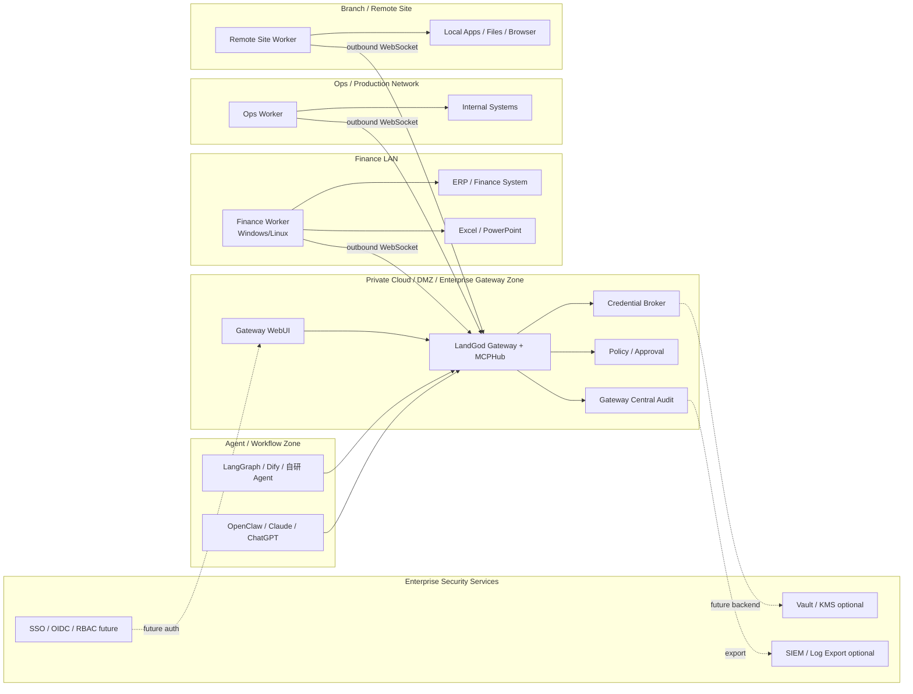
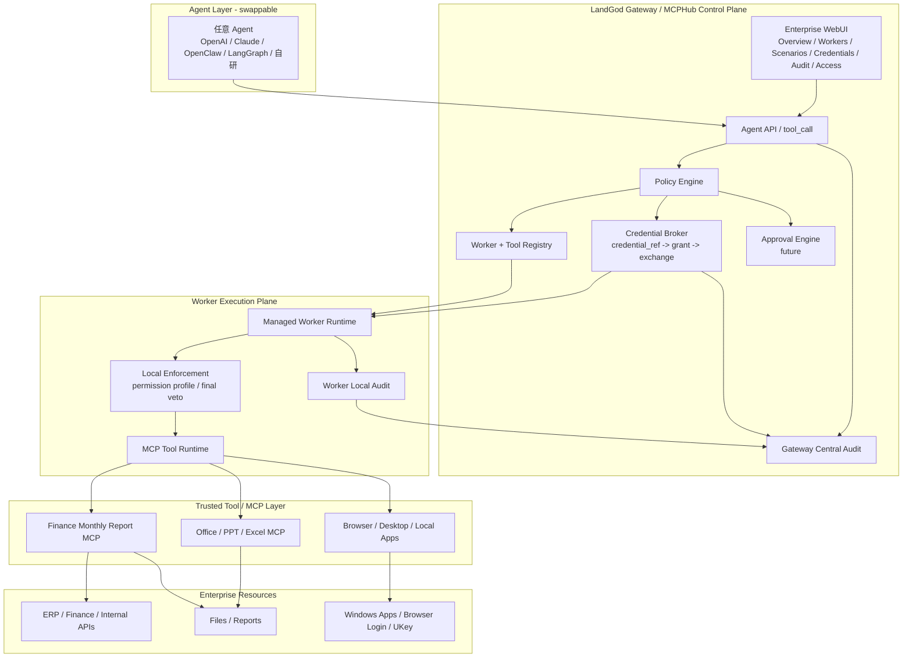

<!-- Source: /home/azureuser/wiki/concepts/landgod-mcphub-product-business-enterprise-review.md -->

# LandGod / MCPHub Product, Business, and Enterprise User Review

## TL;DR

LandGod / MCPHub should be positioned as an **Enterprise Execution Harness for AI Agents**, not as remote shell, remote MCP hosting, RPA, or device management. The product direction is strong because it solves the enterprise Agent gap: safe execution inside real machines, internal networks, local tools, credentials, and workflows.

Current core loop is proven: Gateway + Worker + tool publishing + Credential Broker + WebUI + Gateway/Worker/Credential audit. The next commercial leap is enterprise governance and a sharp Windows/Office/Finance demo.

## Executive Verdict

LandGod / MCPHub 的方向是成立的，而且不是一个小工具方向，而是一个有机会成为 **AI Agent 企业执行基础设施** 的方向。

当前最强定位：

> **LandGod / MCPHub is an Enterprise Execution Harness for AI Agents.**

中文：

> **LandGod / MCPHub 是 AI Agent 的企业级执行 Harness，让任意 Agent 安全调用企业真实环境里的机器、工具、凭据和流程，并留下可审计、可追责的执行证据。**

最强市场洞察：

> **企业不缺会思考的 AI，大模型和 Agent Framework 已经很多；企业缺的是让 AI 在真实系统、真实机器、真实权限、真实网络环境中安全执行的控制层。**

这不是普通 MCP Server，也不是远程桌面，也不是每台机器装一个 Agent。它更像：

```text
Kubernetes schedules containers.
LandGod schedules enterprise tools.
```

AI 时代最小调度单位可能不是容器，而是：

```text
工具 + 机器环境 + 权限 + 凭据 + 审计
```

LandGod 的潜在产品类别是：

```text
Enterprise Agent Execution Platform
Enterprise MCPHub
AI Tool Control Plane
Agent Execution Harness
Enterprise Tool Network
```

---

## 1. Product Review

### 1.1 Product Essence

LandGod / MCPHub 的本质不是“远程调用 shell”，也不是“把 MCP 搬到远端”。它的产品本质是：

> **把企业里分散的机器、网络位置、本地软件、登录态、权限和 MCP 工具，注册成一个可治理的 Agent 执行网络。**

核心架构：

```text
Agent / App / Workflow
        ↓
Gateway / MCPHub Control Plane
        ↓
Worker Execution Plane
        ↓
Local Tools / MCP / Browser / Office / ERP / Files / Desktop
```

当前产品已经有了几个关键骨架：

```text
Gateway
Worker
WebSocket 反连
tool_call
MCP tool publishing
Credential Broker MVP
Gateway WebUI MVP
Gateway central audit
Worker local audit
Credential audit
```

这几个点连起来后，产品已经从“远程工具调用”升级成了：

```text
可控执行链路
```

### 1.1.1 Architecture Diagrams

下面两张图用于把产品本质从“远程工具调用”讲清楚为“Agent 企业执行 Harness”。


#### Enterprise Deployment Topology Diagram




#### System Architecture Diagram



### 1.2 Current Product Strengths

#### Strength A: 方向抓到了企业 Agent 落地的真痛点

很多 Agent 产品停留在：

```text
Chat
RAG
Workflow
API tool calling
```

但企业真实工作在：

```text
内网
Windows
Office
浏览器登录态
UKey
旧 ERP
客户门户
Excel/PPT
财务电脑
本地文件系统
```

LandGod 抓的是“真实执行环境”这个缺口。

#### Strength B: Worker 主动出站连接很适合企业环境

企业内网、客户现场、家庭网络、Windows 电脑通常不能开放入站端口。

LandGod 模式：

```text
Worker → Gateway WebSocket
```

这是非常好的企业部署形态：

- 不要求目标机器暴露端口；
- 适合 NAT / 防火墙 / 内网；
- Gateway 做统一入口；
- Worker 可以分布在不同网络环境。

#### Strength C: Gateway + Worker 分层正确

```text
Gateway says MAY
Worker says CAN
```

这个分层很重要。

Gateway 负责中央策略、调度、凭据、审计。
Worker 负责本地执行、本地能力、本地安全兜底。

企业安全会喜欢这个模型，因为它不是完全信任中央，也不是完全信任边缘，而是形成双层控制。

#### Strength D: Credential Broker 是企业化关键转折点

没有 Credential Broker，LandGod 容易被理解为：

```text
AI 远程控电脑
```

有了 Credential Broker 后，故事变成：

```text
Agent 不拿 secret
Gateway 管理 credential_ref
Worker 只拿 task-scoped grant
trusted tool 才能 exchange credential
全程审计
```

这是从 toy automation 进入 enterprise trust 的关键一步。

#### Strength E: 双审计方向正确

企业会问：

```text
如果 Worker 死了，本地日志没了怎么办？
如果 Gateway 没记，怎么证明中央派发过？
```

现在的双审计模型正确：

```text
Gateway central audit
Worker local audit
Credential audit
```

它能回答：

```text
中央是否派发
本机是否执行
凭据是否合规使用
```

### 1.3 Product Weaknesses / Hard Truths

#### Weakness A: 当前还不是完整企业产品，只是企业产品骨架

现在能 demo，但距离企业买单还有缺口。

企业会要求：

```text
Admin Auth
SSO/OIDC
RBAC
Worker Security Profile
Policy Sync / Ack
Approval Engine
Audit Hash Chain
Vault/KMS
MCP Signing
Version Attestation
Release Signing
SIEM Export
```

当前系统已经证明核心链路可行，但还不能包装成“生产级安全平台”。

正确说法应该是：

> 当前是 Enterprise Execution Harness 的 MVP 骨架，已验证核心闭环；下一步是治理、安全、可运维生产化。

#### Weakness B: 产品边界容易被误解

别人可能会误解成：

```text
远程桌面
远程 shell
MCP server hosting
RPA
设备管理平台
```

必须持续强调：

> LandGod 不是给人控电脑，也不是单个 MCP Server，而是 Agent 的企业执行控制面。

#### Weakness C: Demo 场景需要更尖

只 demo shell/file/audit 不够打动业务买方。

业务买方想看：

```text
财务导表
ERP 查询
Office 报告生成
客户门户下载
内网系统自动巡检
```

所以需要包装一个“尖刀 Demo”：

```text
财务月报自动化 Demo
或
ERP + Excel + PPT 跨系统报告 Demo
```

#### Weakness D: GUI / Office 能力还需要真实 Windows Worker 证明

当前 Azure Linux headless 可以证明 Gateway/Worker/MCP/Credential/Audit 主链路。

但 enterprise buyer 会关心：

```text
Windows Office
PowerPoint
浏览器登录态
UKey
桌面操作
```

必须用 Windows Worker 做一条完整 Demo，不然“企业真实环境”故事不够有冲击力。

---

## 2. Business Review

### 2.1 Market Timing

这个方向时间点很好。

原因：

```text
Agent Framework 爆发
MCP 标准快速扩散
企业开始从 Chat/RAG 走向 Action/Workflow
安全团队开始介入 Agent 落地
API 化改造成本高
无 API / 内网 / 桌面系统依然大量存在
```

市场正在从：

```text
AI tells me what to do
```

走向：

```text
AI does work for me
```

而中间缺的就是安全执行层。

### 2.2 Best Commercial Category

不要只说：

```text
MCPHub
```

因为 MCPHub 对懂 MCP 的人好懂，但对企业买方可能偏窄。

更好的外部类别：

```text
Enterprise Execution Harness for AI Agents
AI Agent Execution Control Plane
Enterprise Tool Network for AI Agents
Governed Agent Execution Platform
```

推荐主品牌话术：

```text
LandGod / MCPHub: Enterprise Execution Harness for AI Agents
```

副标题：

```text
Securely connect AI agents to real enterprise tools, machines, credentials, and workflows.
```

中文：

```text
让 AI Agent 安全连接企业真实机器、工具、凭据和流程。
```

### 2.3 ICP: 最适合的第一批客户

不应该一开始打所有企业。

最适合 ICP：

#### ICP A: 有大量无 API / 半 API 系统的企业

例如：

```text
制造业
供应链
财务外包
跨境电商
物流
政府/国企老系统
```

痛点：老系统多、API 改造慢、人工流程重。

#### ICP B: AI Agent 已经 PoC，但落不了地的企业

他们已经有：

```text
LLM
RAG
Workflow
内部 Agent
```

但卡在：

```text
不能安全执行真实业务动作
```

LandGod 可以作为“执行层”接入。

#### ICP C: 内部 IT / 运维自动化团队

他们需要：

```text
多机器巡检
远程命令
文件读取
服务检查
审计
批量执行
```

这个场景更容易落地，安全阻力比财务低。

#### ICP D: 有 Office / Windows / Desktop 自动化需求的团队

例如：

```text
咨询公司
财务团队
运营团队
销售运营
报告生成团队
```

这里可用 Windows Worker + PPT/Excel/Browser 做强 Demo。

### 2.4 Beachhead Use Case

推荐先选一个尖刀场景：

```text
财务/运营月报自动化：
Agent 调度 ERP Worker、财务 Worker、Office Worker，自动下载数据、整理 Excel、生成 PPT，并通过 Credential Broker 和双审计保证安全。
```

为什么这个场景好：

- 业务价值直观；
- 多系统无 API 痛点明显；
- Office/PPT 可视化效果强；
- 凭据/审计故事自然；
- 适合高层展示。

备选场景：

```text
内网系统巡检 / IT Ops Copilot
供应商门户数据下载
客户后台运营报表
Windows 桌面软件自动化
```

### 2.5 Business Model

建议三层包装：

#### Layer 1: Core Platform

```text
Gateway
Worker network
Tool registry
Routing
Task queue
Basic audit
WebUI
```

按：

```text
Worker 数量
并发任务数
Gateway 部署模式
```

计费。

#### Layer 2: Enterprise Governance Pack

```text
Credential Broker
RBAC/SSO
Approval
Audit hash chain
SIEM export
Policy profiles
Vault/KMS
MCP signing
```

这是高毛利企业包。

#### Layer 3: Scenario Packs

```text
Finance automation pack
Office/PPT automation pack
Internal ops automation pack
ERP/legacy connector pack
Computer-use desktop pack
```

这是加速成交的场景包。

### 2.6 Sales Motion

不要先卖平台愿景，先卖结果。

推荐销售路径：

```text
1. 选一个高频、低风险、手工痛的流程
2. 2 周 PoC：1 Gateway + 2-3 Workers + 1-2 个 trusted tools
3. 展示执行、凭据、审计、人工审批
4. 扩展到更多 Worker / 系统 / 部门
5. 升级 Governance Pack
```

关键成交句：

> 不需要先花三个月改 API；先装 Worker，把现有机器上的能力安全接给 Agent。

---

## 3. Enterprise User Review

企业里至少有四类用户，必须分别打动。

### 3.1 Business User

他们不关心 MCP、Gateway、Worker。

他们关心：

```text
能不能少做重复工作？
能不能自动导表？
能不能生成报告？
能不能少复制粘贴？
出了错我能不能看懂？
```

对他们的产品语言：

> 把每月重复登录系统、下载数据、整理 Excel/PPT 的工作交给 AI，人在最后审核和处理异常。

他们需要的 UI：

```text
任务模板
一键运行
结果预览
异常提示
审批按钮
导出报告
```

### 3.2 IT / Ops User

他们关心：

```text
Worker 是否在线
装在哪些机器
工具有没有注册
失败日志在哪里
怎么升级
怎么配置
怎么批量管理
```

对他们的产品语言：

> Gateway 是中央控制台，Worker 主动出站连接；不用开入站端口，可以统一看机器、工具、任务和审计。

他们需要的 UI：

```text
Worker list
Worker health
Tool inventory
Config profile
Logs
Version
Upgrade status
Connectivity diagnostics
```

### 3.3 Security / Compliance User

他们关心：

```text
谁发起
谁批准
哪个 Agent
哪个 Worker
哪个 tool
哪个 credential
参数是什么
结果是什么
secret 有没有泄露
日志能不能防篡改
```

对他们的产品语言：

> LandGod 把 AI 执行放进企业信任链。Agent 不直接拿 secret；Credential Broker 发 task-scoped grant；Gateway + Worker 双审计。

他们需要的 UI / API：

```text
RBAC
SSO
Policy viewer
Credential access matrix
Approval logs
Audit export
SIEM integration
Hash chain verification
```

### 3.4 Platform / AI Team

他们关心：

```text
怎么接现有 Agent
怎么写 tools
怎么发布 MCP
怎么路由 Worker
怎么做 labels
怎么拿结果
怎么处理长任务
```

对他们的产品语言：

> 你们不用重写 Agent Framework。LandGod 是 Agent-agnostic execution layer，通过 HTTP/SDK/MCP Adapter 接入现有 Agent。

他们需要：

```text
SDK
API docs
MCP adapter
tool manifest examples
test harness
local dev mode
CI integration
```

---

## 4. Competitive Review

### 4.1 vs MCP Server

MCP Server：

```text
把一个 API / 服务包装成 tool
```

LandGod / MCPHub：

```text
把多个机器上的多个 tool / MCP / 本地环境注册成可调度、可治理的工具网络
```

结论：

> LandGod 不替代 MCP Server，LandGod 调度 MCP Server。

### 4.2 vs RPA

RPA：

```text
固定脚本 + UI 自动化 + 流程录制
```

LandGod：

```text
Agent 决策 + Gateway 调度 + Worker 执行 + Tool/MCP 能力 + Credential/Audit
```

结论：

> RPA 是流程自动化，LandGod 是 Agent 执行基础设施。可集成 RPA 工具，但不等于 RPA。

### 4.3 vs Remote Desktop / VNC

Remote Desktop：

```text
人远程看屏幕、点电脑
```

LandGod：

```text
Agent 远程调用工具能力，受权限、凭据、审计控制
```

结论：

> Remote Desktop 是人机交互通道；LandGod 是 Agent 工具执行控制面。

### 4.4 vs 每台机器部署 Agent

每机 Agent：

```text
每台机器一个大脑
```

LandGod：

```text
一个或少数 Agent 大脑 + 多 Worker 手脚
```

优势：

```text
LLM 成本低
决策集中
权限集中
审计清晰
Worker 轻量
```

---

## 5. Product Maturity Assessment

### Current Status

| Area | Status | Assessment |
|---|---|---|
| Gateway | MVP 可用 | 控制面骨架成立 |
| Worker | MVP 可用 | 执行面成立，需生产化配置管理 |
| Tool Call | 可用 | 基础链路跑通 |
| MCP Publishing | 可用 | 需要更多 connector demo |
| Credential Broker | MVP 已验证 | 企业化关键能力，需 Vault/KMS/RBAC |
| Gateway WebUI | MVP | 能 demo，需产品化 UX |
| Audit | 双审计已补 | 需 hash chain、export、retention |
| Security Policy | 局部存在 | 缺中央 Policy Profile |
| Approval | 未完整 | 企业高危动作必需 |
| Admin Auth | 未完整 | 企业部署 P0 |
| Windows/Office Demo | 待补 | 商务展示强依赖 |

### Overall Grade

```text
技术方向：A-
产品定位：A-
当前完成度：B-
企业可销售包装：B
生产级安全：C+
Demo 冲击力：B-
```

如果补齐 P0 能力和一个强 Windows/Finance/Office demo，整体会变成：

```text
企业 PoC 可销售：A-
```

---

## 6. Key Risks

### Risk 1: 被市场误解为“AI 控电脑”

缓解：

```text
所有 pitch 前置 enterprise trust chain
不要先展示 shell_execute
先展示 credential_ref、approval、audit、trusted tool
```

### Risk 2: 安全能力不够企业采购

缓解：

```text
P0 做 Admin Auth / Worker Security Profile / Approval / Audit Export
明确 MVP vs Enterprise Roadmap
```

### Risk 3: Demo 不够业务化

缓解：

```text
做一个财务/Office/ERP 尖刀 Demo
少讲底层工具，多讲业务结果
```

### Risk 4: MCP 生态变化太快

缓解：

```text
LandGod 不绑定 MCP；MCP 是工具接入协议之一
核心是 distributed execution + trust chain
```

### Risk 5: Worker 侧环境复杂

缓解：

```text
Worker capability detection
preflight checks
profile-based setup
health diagnostics
scenario pack installer
```

---

## 7. Recommended Roadmap

### P0: Make It Enterprise Demo-ready

```text
Gateway Admin Auth
Basic RBAC: admin/operator/auditor
Worker Security Profile
Policy Sync / Ack
Server-side Effective Access API
Approval Engine MVP
Audit export JSONL/CSV
Windows Worker + Office/PPT/Browser demo
```

### P1: Make It Security-team Friendly

```text
Audit hash chain
Credential Broker Vault/KMS backend
MCP connector signing/checksum
Tool trust registry
SIEM export
Worker version attestation
```

### P2: Make It Platform-scale

```text
Multi-tenant Gateway
Project/workspace isolation
Task queue / async jobs / retry
Label-based scheduler
SDKs
Marketplace / connector catalog
Billing / usage analytics
```

---

## 8. Recommended Demo Priority

### Demo 1: Security-first Credential Demo

Purpose: 打安全团队。

Show:

```text
credential_ref
single-use grant
trusted tool injection
Gateway audit
Worker audit
Credential audit
```

### Demo 2: Business-first Finance Report Demo

Purpose: 打业务负责人。

Show:

```text
Agent 下载/读取财务数据
生成 Excel/PPT
人类审批
审计留痕
```

### Demo 3: IT Ops Worker Network Demo

Purpose: 打 IT/Ops。

Show:

```text
多 Worker 在线
label routing
batch tool_call
logs/audit
worker health
```

优先级：

```text
Demo 1 已接近完成
Demo 2 最适合销售
Demo 3 最适合快速落地
```

---

## 9. Final Product Review Summary

LandGod / MCPHub 的方向非常好，关键是不要把自己讲小。

不要讲成：

```text
远程 MCP
远程 shell
设备管理
AI 控电脑
```

应该讲成：

```text
Enterprise Execution Harness for AI Agents
```

它解决的是 Agent 落地企业最后一公里：

```text
在哪里执行
用什么权限
哪个工具可信
凭据怎么用
谁审批
怎么审计
出了问题怎么追责
```

当前产品已经有核心闭环：

```text
Gateway + Worker + MCP + Credential Broker + WebUI + 双审计
```

下一步最重要的不是继续堆工具，而是：

```text
1. 企业安全治理补齐
2. Windows/Office/Finance 尖刀 Demo
3. Gateway WebUI 产品化
4. 明确场景包装和销售路径
```

最终推荐对外主话术：

> **LandGod / MCPHub lets AI agents safely execute real work inside the enterprise — across machines, tools, credentials, and workflows — with policy, approval, and audit built in.**

中文：

> **LandGod / MCPHub 让 AI Agent 安全进入企业真实执行环境，跨机器调用工具、使用受控凭据、执行业务流程，并完整留下审批和审计证据。**