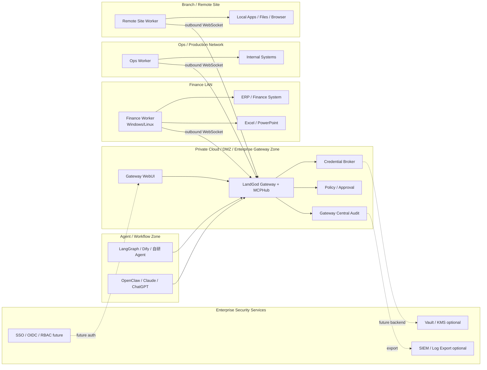
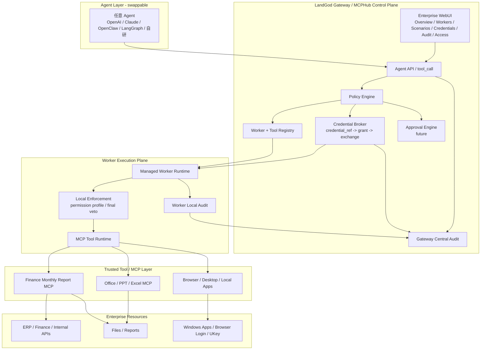

# LandGod / MCPHub — Latest Enterprise Pitch, Deployment Topology, and System Architecture

> Updated for the current project state: Gateway WebUI, Scenarios / Finance Monthly Report demo, Credential Broker, Worker IP/labels, Gateway + Worker + Credential audit, and Agent-swappable execution layer.

## 1. One-line Positioning

**LandGod / MCPHub 是 AI Agent 的 Enterprise Execution Harness：让任意 Agent 安全调用企业真实环境里的机器、工具、凭据和业务流程，并留下可审计、可追责的执行证据。**

More direct:

**大模型负责思考，LandGod 负责让它在企业里安全动手干活。**

Enterprise version:

**LandGod decouples enterprise execution from agent choice. 企业可以切换 Claude、OpenAI、OpenClaw、LangGraph 或自研 Agent，但底层 Worker、凭据、权限、审批和审计保持统一。**

---

## 2. 30-second Pitch Script

今天企业并不缺 AI 大脑，OpenAI、Claude、通义、DeepSeek、自研 Agent 都已经能理解问题、规划步骤、写代码、分析文档。

真正卡住企业落地的是最后一公里：

- Agent 进不了企业内网；
- 用不了员工电脑上的 Office、浏览器登录态、UKey、Windows 客户端；
- 不能直接拿财务密码、API token、证书；
- 执行完以后安全团队不知道谁发起、谁批准、哪台机器执行、用了哪个凭据、结果是什么。

**LandGod / MCPHub 解决的就是这个问题。**

它把企业里分散的机器、网络位置、本地软件、MCP 工具和凭据，通过 Gateway + Worker 注册成一个统一的 AI 执行网络。任意 Agent 都可以通过 Gateway 发起受控 tool_call；Gateway 做策略、凭据、审批和中央审计；Worker 在真实机器上执行，并保留本地审计。

**Agent 不直接接触 secret，Worker 不随便拉密钥，所有执行都有证据链。**

---

## 3. 3-minute Pitch Script

### Opening — 企业 AI 落地的真实瓶颈

现在很多企业已经在试 AI Agent，但很快会遇到一个现实问题：

> Agent 很聪明，但它经常只能说“我建议你怎么做”，不能真正进入企业环境把事情做完。

原因是企业真实执行环境不是一个干净 API 世界，而是：

- 财务系统在内网；
- ERP 只有 Windows 客户端；
- 报表在员工电脑和共享盘里；
- PowerPoint、Excel、浏览器登录态、UKey 都在特定机器上；
- 老系统没有 API；
- 安全团队不允许把密码、token、证书放进 prompt 或交给 Agent。

所以企业不只是需要 Agent Framework，而是需要一个 **Enterprise Execution Harness**。

### Solution — LandGod 是企业执行 Harness

LandGod / MCPHub 的结构是：

```text
任意 Agent / Workflow / Copilot
        ↓
LandGod Gateway / MCPHub Control Plane
        ↓
Worker Execution Plane
        ↓
企业真实机器、本地 MCP、Office、Browser、ERP、文件、内网系统
```

Gateway 负责控制面：

- Worker 注册和在线状态；
- 工具发布和路由；
- Credential Broker；
- 权限策略；
- 审批入口；
- Gateway 中央审计；
- WebUI 管理控制台；
- Scenarios，例如 Finance Monthly Report。

Worker 负责执行面：

- 部署在企业真实机器上；
- 主动出站连接 Gateway，不需要暴露入站端口；
- 执行本地 MCP / 工具 / Office / Browser / 内网系统；
- 保留本地审计；
- 未来接收 Gateway 下发的 Worker Security Profile。

### Differentiation — 不是远程 shell，不是 RPA，不是单个 MCP Server

传统 MCP Server 主要解决：

```text
已有 API → 包成 MCP tool
```

LandGod 解决的是：

```text
机器 + 网络位置 + 登录态 + 本地软件 + 权限 + 凭据 + 审计 → 企业 Agent 执行网络
```

这就是本质差异。

它不是“给 AI 一个远程 shell”，而是：

> **让企业把真实环境里的执行能力，以受控、可审批、可审计的方式提供给任意 Agent。**

### Trust — Credential Broker 和三重审计

企业最关心的是：AI 会不会乱操作？凭据会不会泄漏？审计能不能追责？

LandGod 的凭据流程是：

```text
Agent 只传 credential_ref
Gateway policy check
Gateway 签发 task-scoped single-use grant
Worker 验证 grant
Worker exchange 短期 credential
Trusted MCP tool 执行
Gateway audit + Credential audit + Worker audit
```

Agent 永远拿不到 secret。WebUI 也只显示 metadata，不显示 secret。

当前 Finance Monthly Report demo 已经能展示：

- Gateway central audit：中央派发、结果、错误、超时；
- Credential audit：grant issued / exchange allowed / denied；
- Worker audit：本地执行证据；
- Credential policy：agent、worker group、tool、scope 约束；
- Effective Access：执行前解释某个 Agent 能否用某个 credential 调某个 Worker/tool。

### Value — Agent 可替换，执行层不漂移

企业未来不会只用一个 Agent。研发可能用 Claude Code，业务可能用 ChatGPT Enterprise，流程可能用 Dify/LangGraph，自研系统也可能接入。

LandGod 的价值是：

```text
Agent 可以换；
Gateway / Worker / Credential / Audit / Policy 不用重建。
```

也就是：

> **Agent-swappable, execution-governed.**

---

## 4. Finance Monthly Report Demo Script

### Demo positioning

**Finance Monthly Report 是一个 demo scenario，不是通用 shell smoke test。**

业务故事：

> 财务经理希望 AI 每月自动生成经营月报。AI 不直接拿财务 token，也不在自己机器上处理企业数据，而是通过 LandGod Gateway 调度 Finance Worker，在受控的 MCP 工具里读取 mock ERP orders 和 mock Finance invoices，生成 JSON、CSV、HTML、PPTX 报告，并留下完整审计证据。

### Demo flow

```text
Business request
  → Agent
  → Gateway policy
  → Credential grant
  → Finance Worker
  → Trusted MCP
  → Report artifacts
  → Audit evidence
```

### WebUI demo steps

1. Open Gateway WebUI:

```text
http://127.0.0.1:3000/
```

2. Show `Overview`:

- Gateway status;
- Online Workers;
- Published Tools;
- Credentials;
- recent credential audit.

3. Show `Workers`:

- `BusinessReportWorker` online;
- IP;
- hostname;
- labels: `group=finance-demo`, `role=business-report`, `env=demo`;
- published tool count.

4. Show `Scenarios → Finance Monthly Report`:

- Scenario declaration;
- execution flow;
- flow status cards;
- credential policy;
- demo inputs.

5. Show credential policy:

```text
credential_ref: cred_demo_finance_readonly
allowed agent: agent-business-demo
worker group: finance-demo
allowed tool: business-report-demo.run_monthly_close_demo
allowed scopes: read, report
secret returned: never
```

6. Run demo:

```text
Run finance demo
```

7. Show result artifacts:

- `business_summary_2026-06.json`
- `business_scorecard_2026-06.csv`
- `business_report_2026-06.html`
- `business_report_2026-06.pptx`
- `audit_story_2026-06.md`

8. Show `Audit` page:

- filter by `cred_demo_finance_readonly`;
- filter by `business-report-demo.run_monthly_close_demo`;
- show Gateway audit / Credential audit / Worker audit.

9. Close with the enterprise point:

> 这不是 AI 拿到一个密码去乱跑，而是企业把一个受控业务流程注册成 scenario。Agent 发起请求，Gateway 管权限和凭据，Worker 在正确环境执行，审计证明发生了什么。

---

## 5. Enterprise Deployment Topology



### Topology notes

- Worker 主动出站连接 Gateway，适合 NAT、防火墙、客户现场、内网机器。
- Gateway 是统一入口，Agent 不直接连企业机器。
- WebUI 架设在 Gateway code 中，是管理面。
- Vault/KMS、SIEM、SSO/RBAC 是生产化增强方向。
- Worker 可以按部门/场景/网络位置打 label，例如 `finance-demo`、`ops-prod`、`office-report`。

---

## 6. System Overall Architecture



### Architecture notes

#### Agent Layer

- 可替换；
- 不持有企业 secret；
- 只发起业务意图和 tool_call；
- 通过 `agent_id` 进入 Gateway policy。

#### Gateway Control Plane

- 统一入口；
- 维护 Worker registry、tool registry、credential metadata；
- 做 central policy check；
- 签发 task-scoped grant；
- 提供 WebUI；
- 写 Gateway central audit。

#### Worker Execution Plane

- 部署在真实机器；
- 拥有网络位置、本地软件、登录态、系统能力；
- 执行本地 MCP/tool；
- 对高危操作做本地拒绝；
- 写 Worker local audit。

#### Credential Broker

- Agent 只知道 `credential_ref`；
- Gateway 不把 secret 下发给 Agent；
- Worker 必须拿 task-scoped grant exchange；
- 只有 trusted credential-capable tool 能收到 `_landgod_credential`；
- 审计 grant / exchange / denied。

#### Audit

Current model:

```text
Gateway central audit
+ Credential audit
+ Worker local audit
```

Future production hardening:

```text
Audit hash chain
SIEM export
retention policy
immutable storage
```

---

## 7. What Is Implemented Now vs Next

### Implemented / MVP verified

- Gateway + Worker WebSocket execution path;
- bundled MCP autodiscovery;
- `business-report-demo` MCP;
- Gateway WebUI;
- Scenarios / Finance Monthly Report page;
- Credential Broker MVP;
- `credential_ref -> grant -> exchange -> trusted MCP` flow;
- Gateway central audit;
- Credential audit;
- Worker local audit;
- Effective Access client-side inspector;
- Workers IP/labels/resources display;
- Audit client-side search/filter.

### Production P0 / next enterprise hardening

- Gateway Admin Auth / RBAC / WebUI login;
- Worker Security Profile and policy sync;
- Approval Engine;
- server-side Effective Access API;
- audit export and server-side filtering;
- audit hash chain / immutable audit storage;
- Vault/KMS backend;
- MCP signing / checksum / trust level;
- Worker version attestation;
- SIEM export;
- SSO/OIDC.

---

## 8. Closing Line

**LandGod / MCPHub 的核心不是让 AI 远程控制电脑，而是把企业真实执行能力治理化、凭据安全化、流程场景化、审计证据化。**

Final pitch:

> 企业可以自由选择和切换 Agent；LandGod 让执行层、权限、凭据和审计不漂移。Agent 负责思考，LandGod 负责让它在企业里安全执行。
