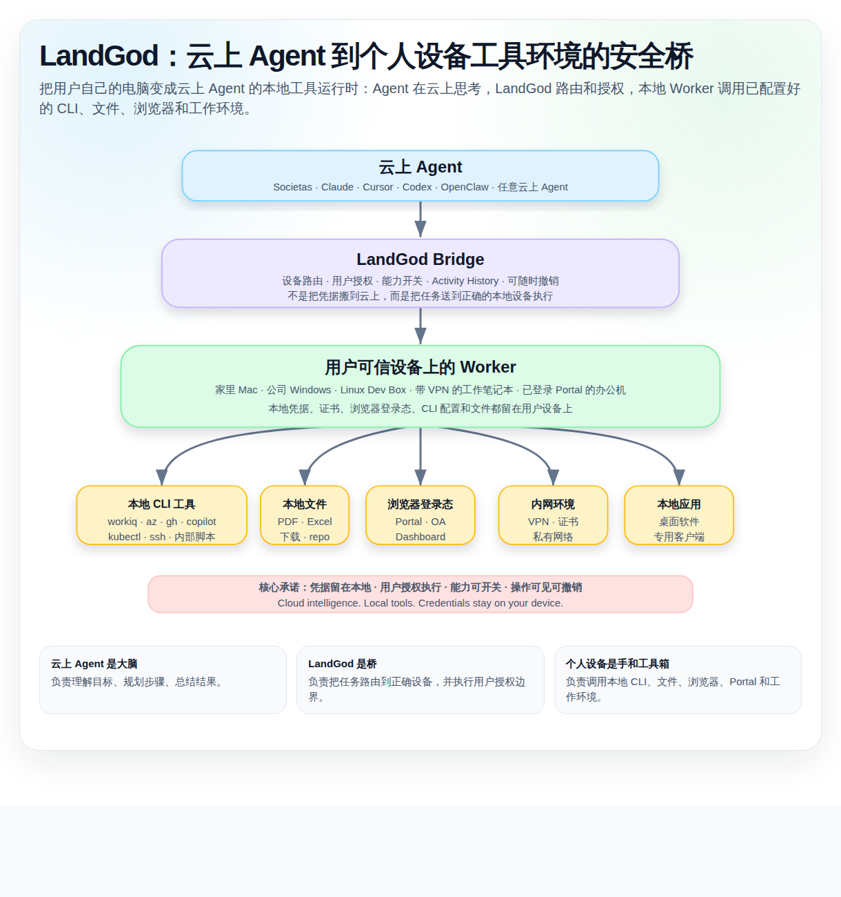

# LandGod 个人用户 Pitch — 云上 Agent，本地工具

## Topic

**Cloud Agent, Local Tools**  
**云上 Agent，本地工具**

**一句话：** LandGod 让云上 Agent 安全使用你个人设备上已经配置好的工具、文件、浏览器登录态和工作环境。

这版 pitch 故意把 LandGod 从“企业级控制面 / 审计平台”收缩为面向个人高级 Agent 用户的 productivity 产品。

个人版 LandGod 的核心不是中央审计，而是：

> 把用户自己的电脑变成云上 Agent 的安全本地工具运行时。

---

## 架构图



HTML 版本： [landgod-personal-local-tools-architecture.html](./landgod-personal-local-tools-architecture.html)

---

## 目标用户

**熟练使用 Agent 的个人用户 / 高级办公用户。**

他们已经会用：

- ChatGPT / Claude / Cursor / Codex；
- OpenClaw / Societas / 云上 Agent；
- GitHub Copilot CLI / Azure CLI / 内部 CLI；
- 各种本地脚本、浏览器登录态、VPN、SSH 配置。

他们的问题不是“不知道 Agent 有什么用”，而是：

> Agent 很聪明，但它够不到我真正工作的那台电脑和那些本地工具。

---

## 核心问题

云上 Agent 很强，但它被困在云上。

用户真正的工作能力往往在自己的设备上：

- 本地文件、下载目录、PDF、Excel、代码仓库；
- 已登录的浏览器页面和公司 Portal；
- 公司 VPN、内网页面、内部 dashboard；
- 已经配置好的 CLI 工具，例如 `workiq`、`az`、`gh`、`copilot`、`kubectl`、`ssh`；
- 某台办公电脑上的证书、登录态、环境变量、私有脚本和本地软件。

但云上 Agent 默认访问不到这些东西。

于是用户自己变成了“桥”：

- 复制命令输出；
- 上传文件；
- 截图给 Agent；
- 在多台设备之间切换；
- 手动登录 Portal；
- 手动执行 Agent 已经规划好的步骤。

新的瓶颈不是 Agent 的推理能力，而是 **本地执行访问能力**。

---

## 三个个人用户高频场景

### 1. 云上 Agent 访问不到用户自己电脑的数据

用户希望 Agent 帮忙分析、总结、整理，但数据在：

- 本地文件夹；
- 工作电脑；
- 公司 VPN 页面；
- 已登录的浏览器 Portal；
- 不能上传到第三方云 Agent 的敏感文件。

今天的做法是用户手动复制、上传、截图。

LandGod 的做法是让 Agent 在用户授权下，通过本地 Worker 去读取指定文件、页面或工具输出。

---

### 2. 用户有多台办公设备，但手边只有一台

一个高级用户可能同时拥有：

- 家里的 Mac；
- 公司 Windows PC；
- Linux dev box；
- 带 VPN 的工作笔记本；
- 某台已经登录 Portal 的办公机；
- 某台装了特定 CLI / SDK / 证书的机器。

问题是：用户当前手边的设备，不一定是拥有正确环境的设备。

LandGod 让云上 Agent 能把任务路由到“真正有环境”的那台设备上执行。

---

### 3. 熟练 Agent 用户遇到最后一公里问题

用户已经非常会用 Agent：

- 会让 Agent 规划任务；
- 会让 Agent 写代码；
- 会让 Agent 总结和分析；
- 会让 Agent 生成命令和操作步骤。

但最后仍然卡在：

- Agent 不能打开本地文件；
- Agent 不能使用本地登录态；
- Agent 不能直接调用本机 CLI；
- Agent 不能在另一台办公电脑执行命令；
- Agent 不能从公司 Portal 里取数。

所以用户仍然要手动充当执行层。

---

## 新 Mission

**把个人设备变成云上 Agent 的安全本地工具运行时。**

英文口径：

> Turn personal devices into secure local tool runtimes for cloud agents.

LandGod 把云上 Agent 的智能，连接到用户自己设备上已经配置好的：

- CLI 工具；
- 本地文件；
- 浏览器登录态；
- VPN / 内网环境；
- 证书和 SSH 配置；
- 本地脚本和软件。

---

## 产品定位

LandGod 是 **云上 Agent 到个人设备工具环境的安全桥**。

```text
云上 Agent
    ↓
LandGod Bridge
    ↓
用户可信设备
    ↓
CLI / 文件 / 浏览器 / Portal / Shell / 本地环境
```

它不是企业中央审计平台，也不是传统远控软件。

它更像：

> 给云上 Agent 接上一条受控的本地工具通道。

---

## 典型工具场景

### WorkIQ CLI

```text
Societas → LandGod → 公司电脑 → workiq status → 结果回传给 Agent
```

### Azure CLI

```text
Claude → LandGod → Dev Machine → az resource list → Agent 分析资源状态
```

### Copilot CLI / 本地代码仓库

```text
Codex → LandGod → MacBook repo → copilot / test / build → 返回修复建议
```

### 公司 Portal

```text
OpenClaw → LandGod → Windows 办公机 → 已登录 Portal → 抽取表格 → 生成报告
```

---

## 个人版卖点

### 1. 使用你已经配置好的工具

不需要把 `az login`、`gh auth`、`workiq login`、SSH key、kubectl config、浏览器 cookie 重新搬到云上。

你的电脑已经配置好了。LandGod 让 Agent 在授权范围内使用它。

### 2. 凭据留在本地

Agent 不需要拿走 token、证书、SSH key、浏览器 cookie。

它只发送任务意图，真正执行发生在你的设备上。

### 3. 云上智能 + 本地执行

```text
Cloud Agent = 大脑
LandGod = 桥
Your Device = 手 + 工具 + 凭据 + 环境
```

### 4. 多设备协同

哪台机器有正确环境，就在哪台机器执行。

用户不再因为“那台电脑不在手边”而卡住。

---

## 推荐 Pitch 话术

### 简短版

云上 Agent 很强，但它用不了你电脑上已经配置好的工具。

你的 `workiq`、Azure CLI、Copilot CLI、GitHub CLI、SSH 配置、浏览器登录态、VPN 页面、本地文件和代码仓库，都在你的个人设备上。

今天，你只能自己复制输出、上传文件、截图、切换设备、手动执行命令。

LandGod 把你的个人设备变成云上 Agent 的安全本地工具运行时。Agent 在云上思考，LandGod 把任务路由到正确设备，本地 Worker 调用已有工具并把结果回传。凭据留在本地，执行过程可见、可撤销，控制权在你手里。

### Slide tagline

**云上 Agent 负责思考，LandGod 连接设备，本地工具负责执行。**

或者：

**Cloud intelligence. Local tools. Credentials stay on your device.**

---

## 两页 PPT

HTML 版本： [landgod-personal-agent-pitch.html](./landgod-personal-agent-pitch.html)

- Slide 1：云上 Agent，本地工具 — 为什么熟练用户仍然卡住
- Slide 2：把个人设备变成云上 Agent 的本地工具运行时
