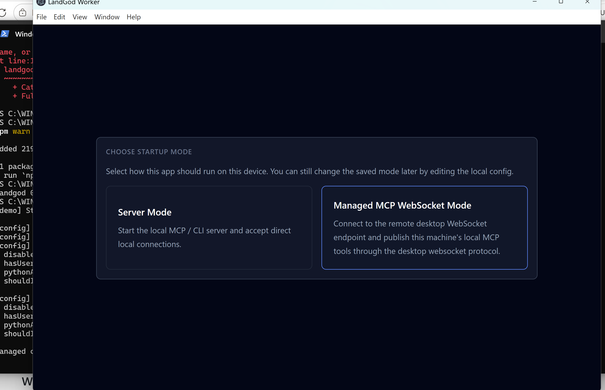

# 🖥️ LandGod Worker — Windows & macOS Quick Start

> Install LandGod Worker on your local machine to connect it to the LandGod remote management network.

---

## 📋 Prerequisites

| Dependency | Windows | macOS |
|------------|---------|-------|
| Node.js (v18+) | Download from [nodejs.org](https://nodejs.org/) | `brew install node` |
| npm | Included with Node.js | Included with Node.js |

---

## 🚀 Install LandGod Worker

Open a terminal (Windows: PowerShell, macOS: Terminal):

```bash
npm install -g https://raw.githubusercontent.com/zhou12138/cli-server/master/downloads/landgod-0.1.15.tgz
```

Verify the installation:

```bash
landgod --version
# Expected output: landgod 0.1.15
```

> 💡 If `landgod` is not recognized, close and reopen your terminal.

---

## 🐍 Install Python (Optional — required for screenshot/remote control)

LandGod includes built-in Computer Use capabilities (screenshot, click, type, scroll) that require Python. Skip this step if you don't need these features.

### Windows

```powershell
# Install Python
winget install Python.Python.3

# Close and reopen terminal, then install dependencies:
python -m pip install pyautogui
python -m pip install Pillow
```

### macOS

```bash
# macOS usually ships with python3. If not:
brew install python3

# Install dependencies
python3 -m pip install pyautogui
python3 -m pip install Pillow
```

> The Worker automatically detects Python at startup. If Python is not available, Computer Use is silently skipped — all other features work normally.

---

## 📊 Enable PPTX Editor (Optional — PowerPoint automation)

LandGod includes a built-in PPTX Editor MCP server that provides full PowerPoint automation: inspect slide structure, modify text/shapes/tables/charts, add elements, export PDF/images, and more. Skip this step if you don't need PowerPoint editing.

### Windows

```powershell
# Install dependencies
python -m pip install pywin32

# (Optional) For 10-20x faster batch operations via VBA backend:
# Open PowerPoint → File → Options → Trust Center → Trust Center Settings →
# Macro Settings → ✅ Trust access to the VBA project object model
```

### macOS

> ⚠️ PPTX Editor requires Microsoft Office COM automation and is **Windows-only**. On macOS, this feature is not available.

### How it works

The Worker automatically detects Python + pywin32 at startup and registers 6 tools:

| Tool | Description |
|------|-------------|
| `pptx_open` | Open a .pptx file (returns slide structure) |
| `pptx_inspect` | Get current presentation structure |
| `pptx_exec_actions` | Execute editing actions (batch supported) |
| `pptx_save` | Save (or Save As) |
| `pptx_close` | Close and release COM resources |
| `pptx_help` | Show available actions and usage reference |

**Two backends** — `vba` (default, 10-20x faster) with auto-fallback to `pywin32` if Trust Center is not enabled. Switch dynamically via `pptx_open(backend="pywin32")` or `pptx_open(backend="vba")`.

**Visible mode** — use `pptx_open(filepath, visible=true)` to watch edits live. The UI auto-navigates to the target slide before each action.

> If pywin32 is not installed, PPTX Editor is silently skipped — all other features work normally.

---

## 📋 Enable Shiproom Tools (Optional — team meeting automation)

LandGod includes a built-in Shiproom MCP server that automates meeting prep, agenda updates, Loop/OCV sync, and more via SharePoint. Skip this step if you don't need Shiproom.

### 1. Install Python dependencies

```powershell
# Windows
python -m pip install "mcp[cli]" pyyaml msal requests openpyxl beautifulsoup4

# macOS
python3 -m pip install "mcp[cli]" pyyaml msal requests openpyxl beautifulsoup4
```

### 2. Get your config file

The Societas team's config is maintained in the praesto-claw repo:

👉 **[societas-shiproom/shiproom-config.yaml](https://github.com/gim-home/praesto-claw/blob/main/apps/client_agent/praestoclaw/skills/bundled/societas-shiproom/shiproom-config.yaml)**

> Requires Microsoft EMU SSO — sign in with your `@microsoft.com` account.

open the GitHub link above in a browser, copy the raw content, and save it manually as `shiproom-config.yaml`.

### 3. Start with your config

Pass the config path using an **absolute path** via `--config`:

```powershell
# Windows — use absolute path
landgod start --ui --demo --config C:\edge_workspace_1\shiproom-config.yaml

# macOS
landgod start --ui --demo --config ~/shiproom-config.yaml
```

Or set it once as a permanent environment variable (takes effect after restarting LandGod):

```powershell
# Windows — persist across reboots
[System.Environment]::SetEnvironmentVariable("SHIPROOM_CONFIG", "$env:USERPROFILE\shiproom-config.yaml", "User")

# macOS — add to ~/.zshrc or ~/.bashrc
export SHIPROOM_CONFIG=~/shiproom-config.yaml
```

### 4. Verify

Restart LandGod. Shiproom tools (e.g. `shiproom_prep`, `shiproom_update`, `shiproom_fetch_loop`) will appear automatically in the tool list if detection succeeds.

> If `SHIPROOM_CONFIG` is not set, the server looks for `shiproom-config.yaml` in the same directory as `server.py`. If no config file is found, Shiproom tools are silently skipped.

---

## ▶️ Start

```bash
landgod start --ui --demo --config C:\edge_workspace_1\shiproom-config.yaml
```

> 💡 `--config` requires an **absolute path** to the Shiproom config file.
>
> ⚠️ `--demo` mode disables all security restrictions (command allowlist, content filtering, etc.). **Use only for demos and local testing.**

---

## 🖥️ Choose Startup Mode

After launching, a UI window will appear prompting you to **Choose Startup Mode**:



Select **"Managed MCP WebSocket Mode"** (the right option) to connect this device to a remote LandGod Gateway and publish its local tools over WebSocket. This is the recommended mode for remote management.

> **Server Mode** (left option) is for local-only connections and does not connect to the Gateway.

---

## ❓ Troubleshooting

| Problem | Solution |
|---------|----------|
| `landgod` command not found | Close and reopen terminal; or check that `npm prefix -g` is in your system PATH |
| Python features unavailable | Restart terminal after installing Python; verify with `python --version` (Windows) or `python3 --version` (macOS) |
| Shiproom tools not showing | Verify: `python -c "import mcp.server.fastmcp"` succeeds; check `SHIPROOM_CONFIG` points to a valid yaml file |
| Shiproom login popup not appearing | Run `landgod` from a real terminal (not a background service) — MSAL WAM login requires a console window |
| Electron errors | First run of `landgod start --ui` auto-installs Electron dependencies — requires internet |
| macOS permission prompt | Screenshot requires granting Screen Recording permission in System Settings → Privacy & Security |
| PPTX tools not showing | Verify: `python -c "import win32com.client"` succeeds; Worker must run from a desktop session (not Session 0/schtasks) |
| VBA backend fails | Enable Trust Center macro access (see PPTX Editor section above); auto-fallback to pywin32 handles this gracefully |
| PowerPoint OOM on 2GB RAM | Close other Office instances; run `taskkill /f /im POWERPNT.EXE` before opening |

---

## 🔗 Links

- [Gateway Setup Guide](./QUICKSTART-GATEWAY.md)
- [Full Documentation](../docs/)
